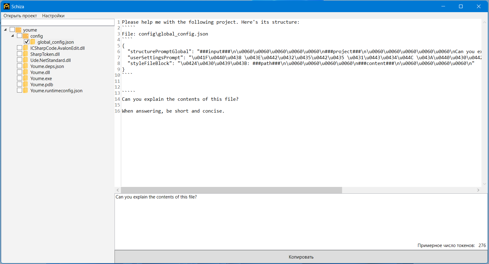
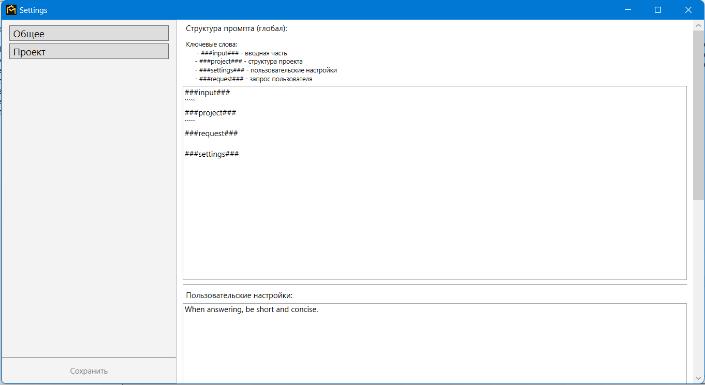

# 
**Schiza**

<image src="assets/icon.png" width="200px"/>

> A tool for working on projects in tandem with neural network assistants.

---
## 📦 Functionality

The following features are currently implemented:
- Global and local prompt creation settings.
- Conveniently connect required context parts.
- Drag-and-drop links to project files and directories in the request.
- Context-sensitive token counter in the resulting request.
- Preview of the final request after it's built and saved to the clipboard.

---
## 🖼 Screenshots

---
## ⚙️ Technical info
.NET 8.0, WPF
- AvalonEdit 6.3.1.120
- SharpToken 2.0.4
- Ude.NetStandart 1.2.0

---
[LICENSE](LICENSE)
